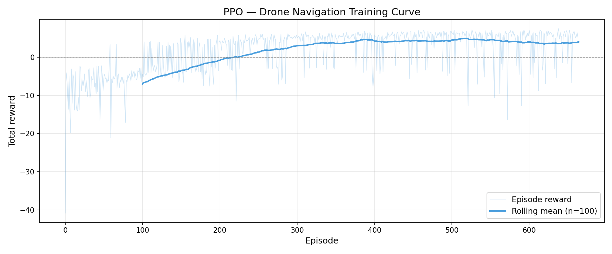

# Autonomous 3D Drone Navigation using Reinforcement Learning



## Overview
This project implements an autonomous navigation system for a quadrotor drone in a complex 3D environment. Using **Deep Reinforcement Learning (DRL)**—specifically the **Proximal Policy Optimization (PPO)** algorithm—the drone learns to navigate from a starting point to a target goal while smoothly avoiding buildings, trees, and ground rocks.

## Features
- **Custom 3D Environment**: Built with `Gymnasium` to simulate realistic drone flight physics and 10-directional LiDAR sensor data.
- **PPO Agent**: Trained using `Stable Baselines 3`, featuring a multi-layer perceptron (MLP) capable of navigating continuous 3D coordinate space.
- **High-Fidelity Visualization**: A custom visualizer utilizing `PyBullet` for realistic 3D rendering of the drone, obstacles, flight trail, and HUD.
- **Evaluation & Metrics**: Scripts provided to compute success rates, collision frequencies, and navigation efficiency across multiple episodes.

## Installation

1. Clone the repository:
   ```bash
   git clone https://github.com/zeel8704/Drone-Path-Navigation.git
   cd Drone-Path-Navigation
   ```

2. Install dependencies:
   ```bash
   pip install -r requirements.txt
   ```

## Usage

### 1. Training the Agent
To train a new agent from scratch, run the training script. This script sets up 8 parallel environments, applies observation normalization, and uses the PPO algorithm.
```bash
python train.py
```
> Models and checkpoints will be saved in the `models/` directory, while evaluation logs will go to `logs/`.

### 2. Evaluating the Model
To rigorously test a trained model over multiple episodes (default is 200) and view collision, success, and timeout rates:
```bash
python evaluate.py
```

### 3. Visualizing the Flight
To visually validate the drone's behavior in the 3D physics engine (PyBullet):
```bash
python visualize.py
```
> The visualization provides a detailed follow-camera perspective, highlighting the drone's active rotors, flight path, and a real-time HUD showing status alerts.

## Project Structure
- `drone_env.py`: The custom Gymnasium environment handling physics and sensor logic
- `train.py`: The PPO training pipeline using Stable Baselines 3
- `evaluate.py`: The evaluation script tracking success and collision variants
- `visualize.py`: The PyBullet-based 3D visualizer for the agent's behavior
- `requirements.txt`: Python dependencies

## Built With
- **Python 3.10+**
- **[Gymnasium](https://gymnasium.farama.org/)**
- **[Stable Baselines 3](https://stable-baselines3.readthedocs.io/)**
- **[PyBullet](https://pybullet.org/)**
